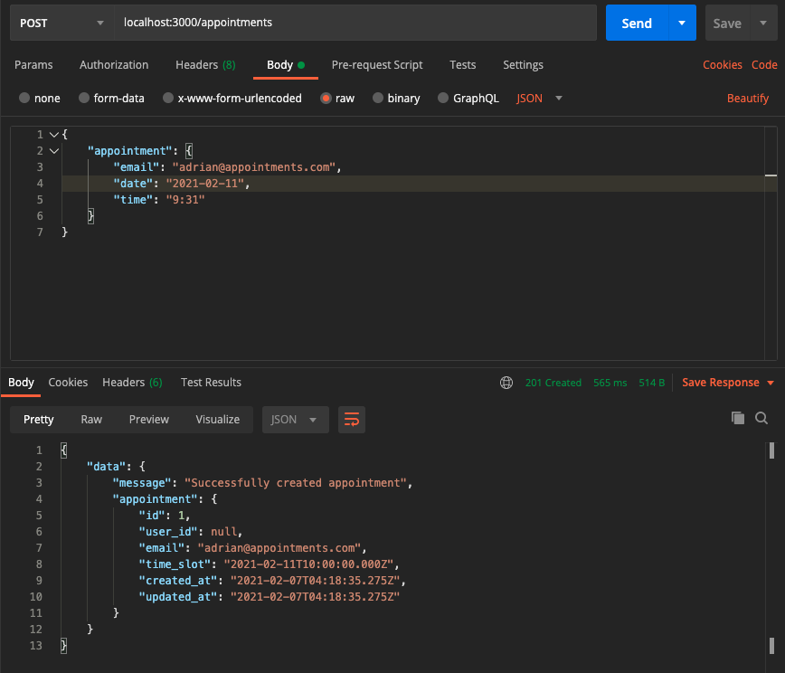
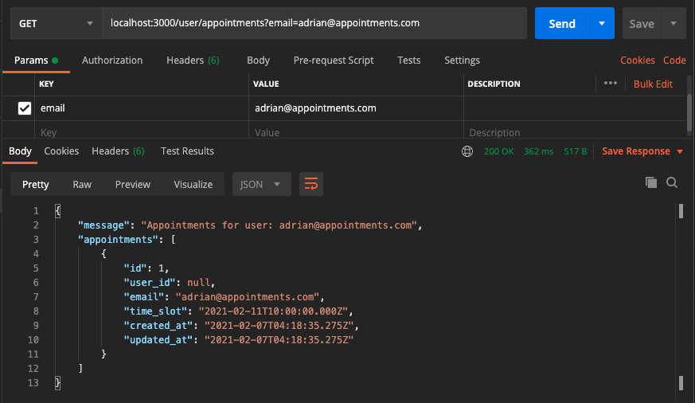

# Ruby Appointment Scheduler

This is an example for the Rails Docker container [application](https://github.com/drincruz/docker-rails).
It uses the docker-rails base and builds a simple API with a bit of the datastore
flushed out in Postgresql.

## Getting Started

The Rails app has already been built and you should only need to
run the following:

### Build the Docker containers

You need to build new Docker containers initially. This is probably the
longest part because we need to install dependencies and such.

```bash
docker-compose build && docker-compose up
```

#### Check the database

The postgresql container mounts a SQL boot script to create the database on init.

You should be able to navigate to localhost:3000 and you should see the Rails
welcome page. If not, try running the following:

```bash
docker-compose run web rake db:create
```

### localhost

That's it! You should be able to navigate to localhost:3000 and see the
default Rails app page.

## Tests

This application uses `rspec`.

### `docker-compose` tests

You can run the `rspec` tests in the Docker container after its built by issuing
the following command:

```bash
docker-compose run web bundle exec rspec spec
```

### Github Actions CI

This repo is set up to run the tests on pull requests. See the [Actions tab](https://github.com/drincruz/ruby_appointment_scheduler/actions).

## Postman Examples

### Sending a POST to Create an Appointment



### Getting a User's Appointments



## TODO

This is just an example API application, but some nice-to-haves are listed below.

- [ ] Clean up `User`; currently anonymous users are supported, but seed users would
      be nice. Once cleaned up, we can have a `UsersController` that can handle
      the relationship between appointments and users better.
- [ ] Cleaner failure handling; the failures for invalid input are just rescued,
      which is nice, but we can have clearer messaging.
- [ ] Input validation; the _validation_ is pretty rudimentary as of now. I am sure
      there are a lot of cleaner ways to validate user input.
